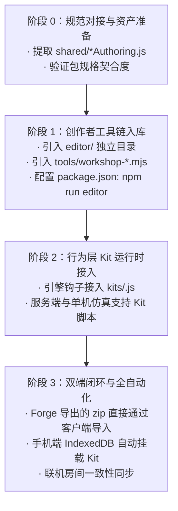

# Stronghold-Protocol-Forge 0.13.0 深度评估与集成计划

> 评估对象：`C:\Users\J1825\Downloads\Stronghold-Protocol-Forge-0.13.0-0.2.2-win-x64.zip`  
> 目标仓库：`Paper-Yuan/Stronghold-Protocol`（当前基线 `0.2.2-fusion`）  
> 执笔：石井 | 安全与架构研究

---

## 一、Forge 0.13.0 架构与本质解构

通过逆向解压并比对该压缩包，核心结论如下：

1. **定位明确**：
   `Stronghold-Protocol-Forge` 是官方同人社区为《卫戍协议》研发的**专业工坊编辑器（Workshop Editor）与创作者闭环系统**。其版本号 `0.13.0-0.2.2` 中的 `0.2.2` 正是其锁定的游戏引擎基线，与我们当前的 `0.2.2-fusion` 代码基线 **100% 同构匹配**。
2. **核心组成部分**：
   - **`editor/`（可视化 Web 编辑器）**：
     - 提供 9 大专属工作台：干员制作（`/`）、地图搭建（`/stage.html`）、敌人（`/enemy.html`）、波次（`/wave.html`）、装备（`/item.html`）、盟约（`/bond.html`）、行为层 Kit 编写（`/kit.html`）、语音配置（`/voice.html`）、模组打包（`/pack.html`）。
     - 支持 2D 编辑 + 3D 战场透视预览，干员面板直连官方 112 名干员的数值库与 Spine 模型。
   - **`shared/*Authoring.js`（权威规则与推导核心）**：
     - `chessAuthoring.js`, `bondAuthoring.js`, `itemAuthoring.js`, `kitAuthoring.js`, `stageAuthoring.js`, `waveAuthoring.js`, `enemyAuthoring.js`, `workshop.js`。
     - 该套代码让编辑器、CLI 校验器与运行时共用同一套严格契约，确保创作者产物“所见即所得、合规即可跑”。
   - **`tools/workshop-*.mjs`（创作者工具链）**：
     - `workshop-editor.mjs`：独立启动编辑器 Web 服务的入口。
     - `workshop-validate.mjs`：MOD 静态语义与黑板树严密门禁校验。
     - `workshop-pack.mjs`：一键导出为标准的 `.zip` / `.spmod` 分发包。
     - `workshop-scaffold.mjs`：快速生成模组初始骨架。
   - **`kits/` 行为层（Kit Engine）**：
     - 允许干员不仅拥有数值，还能通过 JavaScript 钩子总线（`kits/<chessId>.js`）编写定制技能、天赋、护盾、召唤物逻辑。
3. **架构解耦与安全性**：
   - `editor/` 位于项目根目录下，**完全不在 `public/` 内部**。
   - **关键收益**：纳入我们项目后，移动端 Android 打包（`npm run pack:mobile`）与纯净网页客户端**不会增加哪怕 1KB 的冗余**，APK 和手机端性能保持零干扰！

---

## 二、接入规划蓝图（分阶段实施）

整个接入按 **三阶段四步走（Phase 0 ~ Phase 3）** 推进，确保主线随时可运行、随时可测试。



---

### Phase 0: 规范对接与工具链准备（零风险准备期）

- **动作**：
  1. 解压提取 Forge 包内的 `app/shared/*Authoring.js` 与 `app/shared/workshop.js`；
  2. 提取 `app/tools/workshop-*.mjs`（`validate`, `pack`, `scaffold`, `editor`）；
  3. 比对 `shared/customContent.js` 与 `shared/workshop.js` 的接口互通性。
- **验收标准**：
  - 运行 `node tools/workshop-validate.mjs packs/fanpack`，能够直接对仓库现有的内容包通过完整静态校验。

---

### Phase 1: 创作者编辑器（Forge Editor）无缝集成

- **动作**：
  1. 将 Forge 的 `app/editor/` 完整复制至我们仓库的 `editor/`；
  2. 在 `package.json` 的 `scripts` 中增加快捷指令：
     ```json
     "editor": "node tools/workshop-editor.mjs",
     "workshop:validate": "node tools/workshop-validate.mjs",
     "workshop:pack": "node tools/workshop-pack.mjs",
     "workshop:scaffold": "node tools/workshop-scaffold.mjs"
     ```
  3. 在仓库根目录提供 Windows 快捷脚本：`启动工坊编辑器.bat`。
- **安全隔离验证**：
  - 执行 `npm run bundle:android`，核对生成的 `app_bundle.zip` 体积，确保 `editor/` 未被纳入客户端资源包，APK 纯净性保持 100%。

---

### Phase 2: 行为层 Kit 运行时引擎打通

- **动作**：
  1. 在游戏对局与模拟引擎（`server/sim/` 与 `public/js/sim/`）中引入 `kits/` 动态脚本装载器；
  2. 为干员技能触发（`skill`）、普攻判定（`attack`）、死亡或离场事件（`onKilled` / `onLeave`）打通钩子；
  3. 支持安全沙箱环境运行 Kit 逻辑（避免恶意 JS 越权）。
- **验收标准**：
  - 使用 Forge 制作一个带定制 Kit 技能的干员并打包，单机模拟器与联机对局中能准确触发技能特效与伤害。

---

### Phase 3: 多端闭环与生态互通

- **动作**：
  1. Forge 制作完成点击“导出模组”，生成标准 `.zip`；
  2. 打开 PC 网页版或 Android 手机版，点击主页【模组】管理器；
  3. 直接选取该 `.zip`，客户端流式解析器（`modZipParser.js`）秒级解析出卡片、干员特质、README；
  4. 存入手机端 IndexedDB（`sp_mod_storage`），离线与联机房间即刻生效。

---

## 三、进入我们项目的首批操作清单 (Ready to Execute)

| 步骤 | 操作目标 | 涉及文件/路径 | 耗时评估 |
|---|---|---|---|
| **Step 1** | 从本地 ZIP 解压提取 `editor/`、`tools/workshop-*.mjs`、`shared/*Authoring.js` | `editor/`, `tools/`, `shared/` | 1 分钟 |
| **Step 2** | 更新 `package.json` scripts 命令并添加 `启动工坊编辑器.bat` | `package.json`, 根目录 bat | 1 分钟 |
| **Step 3** | 启动并验证工坊服务（默认端口 3001 或 3000/editor） | `http://localhost:3001` | 即时 |
| **Step 4** | 运行全量单元测试与 Android APK 打包门禁回归 | `test/*.test.js`, `pack:mobile` | 2 分钟 |

---
*本文档为 Stronghold-Protocol-Forge 0.13.0 集成路线图。*
