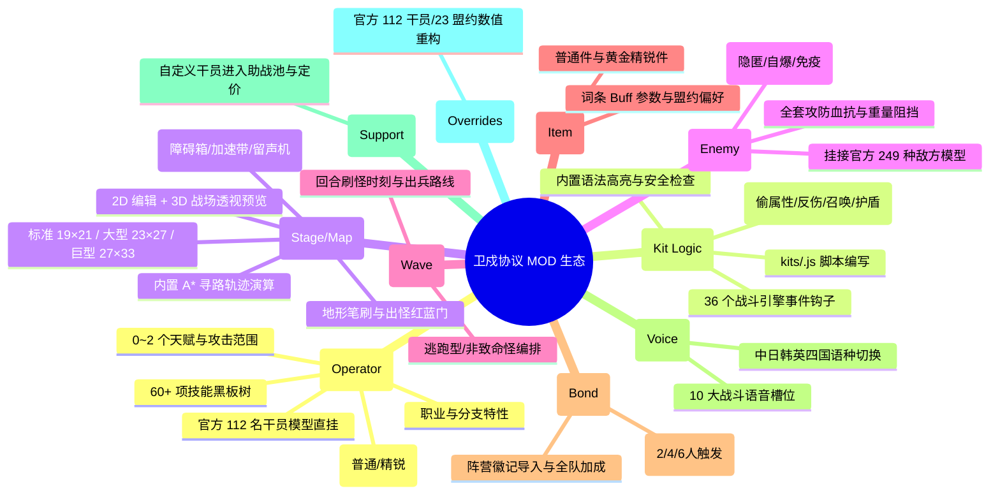

# 卫戍协议（Stronghold Protocol）工坊生态与 MOD 创作体系全景指南

> 文档基线：`v0.2.2-fusion`（游戏引擎） / `v0.13.0`（Forge 工坊编辑器）  
> 执笔：石井 | 安全研究与工程架构  
> 适用对象：开发者、模组创作者、安全运维

---

## 一、 生态背景与核心架构

`Stronghold-Protocol-Forge 0.13.0` 是官方同人社区研发的**全套独立工坊编辑器（Workshop Editor）与创作者闭环系统**。其代码基线锁定上游游戏引擎 `0.2.2`，与当前项目的 `0.2.2-fusion` **100% 同构匹配**。

### 1. 架构核心原则（铁律）
1. **零污染与非侵入（Non-Invasive Overlay）**：
   - 官方游戏底层数据（`data/*.json`、官方素材包）**绝对只读**，禁止任何形式的文件覆盖式安装。
   - 所有 MOD 内容均以**内存增量图层（Overlay）**形式动态合并挂载。
2. **多端统一的标准包格式（Standard Mod Package）**：
   - 统一格式为 `.spmod`（底层为标准 ZIP 归档，直接 `.zip` 亦可无缝识别）。
   - 根目录下强制具备 `pack.json`（核心元数据）与 `README.md`（说明文档）。
3. **零 APK 负担与安全隔离**：
   - 工坊编辑器位于项目根目录 `editor/`，**完全独立于 `public/` 外部**。
   - 移动端打包（`npm run pack:mobile`）会自动剥离，**绝不增加 Android APK 哪怕 1KB 的冗余体积**。

---

## 二、 MOD 支持种类全景图（10 大核心种类）

Forge 编辑器通过 9 大专属工作台与严格的数据推导器，支持创作者产出涵盖**数值、图形、地图、音频及脚本逻辑**的 10 大类 MOD：



### 10 大类别详细能力对照表

| 序号 | MOD 类别 | 对应工作台 | 核心能力与输入规格 |
|---|---|---|---|
| **1** | **干员 Mod**<br>*(Operator)* | `/` (首页) | 面板属性（生命/物攻/物防/法抗/攻击间隔）、职业/分支、伤害类型（物理/法术/真实）、对空判定、0~2 个天赋、手动/自动/弹药制技能、60+ 技能黑板树参数、184 种攻击范围模板、关联官方干员立绘与骨骼。 |
| **2** | **行为层脚本 Mod**<br>*(Kit / Logic)* | `/kit.html` | **最高阶模组**。通过 `kits/<chessId>.js` 直接接入战斗引擎事件总线。支持 36 个事件钩子（技能释放、受击、击杀、阵亡、治疗、tick 判定等），可实现任意原创被动、护盾、召唤物、全图反伤机制。内置静态语法审查。 |
| **3** | **关卡与地图 Mod**<br>*(Stage / Map)* | `/stage.html` | 支持 19×21、23×27、27×33 三种棋盘规格。自由刷取地面、高台、不可通行、深坑、滑索；配置障碍箱、加速带等战场装置；内置 A* 算法自动生成陆空寻路轨迹；支持 2D 笔刷与 3D 战场透视预览。 |
| **4** | **敌人与 Boss Mod**<br>*(Enemy)* | `/enemy.html` | 制作小怪、精英怪、领袖 Boss。支持生命、物防、法抗、阻挡数、重量、移速；自定义隐匿、自爆、阶段重生、免疫沉默；关联官方 249 种敌人模型。 |
| **5** | **波次时间线 Mod**<br>*(Wave Timeline)* | `/wave.html` | 自定义每一回合的出怪时间轴（刷怪时刻、刷新数量、间隔、路线、撤退口），支持编排鸭爵、高普尼克等非伤害型特殊机制怪。 |
| **6** | **装备与藏品 Mod**<br>*(Item / Equipment)* | `/item.html` | 制作局内装备，分为普通件与精锐件（黄金装）。配置攻击力、攻速、吸血、免伤等词条 Buff；绑定盟约偏好标签（`giveBondId`）与商店金币价格。 |
| **7** | **阵营与盟约 Mod**<br>*(Bond / Alliance)* | `/bond.html` | 制作原创阵营盟约（如卡兹戴尔、罗德岛、深海猎人）。配置 2/4/6 人阶段性羁绊阈值与效果；导入盟约徽记图标；实时推导战力加成。 |
| **8** | **语音与配音 Mod**<br>*(Voice / Audio)* | `/voice.html` | 可作为纯配音 Mod，或为新干员配音。覆盖 10 大战术语音槽（出击、选中、部署、技能 1~4、四种结算评级）；支持中/日/英/韩四国语种切换。 |
| **9** | **助战池 Mod**<br>*(Support Pack)* | `pack.json` | 将原创干员注册进助战池系统，配置出现概率、招募阶级与商店售价。 |
| **10** | **官方平衡补丁**<br>*(Overrides)* | `/pack.html` | 直接覆写官方已有 112 名干员或 23 种官方盟约的数值，制作赛事平衡版、机制大修版补丁。 |

---

## 三、 多端统一存储与加载架构设计

根据《MOD 统一存储与运行时规范》（`docs/MOD_STORAGE_SPEC.md`），系统在各端的分层存储如下：

```text
┌─────────────────────────────────────────────────────────────────┐
│                 创作者使用 Forge 编辑器一键打包                  │
│                     导出 my-mod.zip (.spmod)                     │
└────────────────┬───────────────────────────────┬────────────────┘
                 │                               │
                 ▼                               ▼
    【PC 服务端 / 联机主机】             【手机端 / 离线单机沙盒】
     (Node.js 文件系统)                 (Browser / Android WebView)
  ┌──────────────────────┐          ┌───────────────────────────┐
  │ 存储于 packs/<id>/   │          │ 存储于 IndexedDB          │
  │ 解包为平铺 JSON+Art  │          │ (sp_mod_storage)          │
  ├──────────────────────┤          ├───────────────────────────┤
  │ 运行时：             │          │ 运行时：                  │
  │ GlobalModManager 扫描│          │ modStorage 读出 JSON      │
  │ mergeCustomContent   │          │ 注入客户端 dataStore      │
  │ 内存 Overlay 动态注入│          │ Blob 图片转 ObjectURL     │
  └──────────────────────┘          └───────────────────────────┘
```

### 存储层优势：
1. **突破 5MB 限制**：客户端改用 IndexedDB 物理存储，支持存储 100MB+ 的大体积高精 Spine 动画、图片与音频，告别 localStorage 崩溃风险。
2. **零网络依赖**：手机端在完全断网/单机飞行模式下，已安装的 MOD 依然完好保存在本地数据库中，即开即玩。
3. **联机一致性裁决**：联机房间房主广播 `requiredPacks` 哈希清单，服务端按房间策略（`OPTIONAL` / `STRICT_VANILLA`）仲裁，防止作弊或不同步。

---

## 四、 Forge 编辑器接入执行计划

整套接入划分为 **4 个独立里程碑**，全程保证主线代码可跑、测试全过：

### 里程碑 0：规则与工具链准备（零风险）
- **实施内容**：
  1. 将 Forge 的 `shared/*Authoring.js` 与 `shared/workshop.js` 复制进 `shared/`；
  2. 将 `tools/workshop-*.mjs`（`validate`, `pack`, `scaffold`, `editor`）复制进 `tools/`；
- **验收目标**：
  - 运行 `node tools/workshop-validate.mjs packs/fanpack`，能直接对现有同人包通过静态规则门禁。

### 里程碑 1：独立引入工坊可视化编辑器（工具层集成）
- **实施内容**：
  1. 将 Forge 的 `editor/` 目录完整放入仓库根目录；
  2. 在 `package.json` 添加指令：
     ```json
     "editor": "node tools/workshop-editor.mjs",
     "workshop:validate": "node tools/workshop-validate.mjs",
     "workshop:pack": "node tools/workshop-pack.mjs"
     ```
  3. 根目录添加快捷启动脚本：`启动工坊编辑器.bat`。
- **验收目标**：
  - 双击 bat 或运行 `npm run editor`，浏览器打开 `http://localhost:3001`，9 大工作台完全正常运作。
  - 运行 `npm run pack:mobile`，验证 APK 体积与 Git 状态，确认 `editor/` 未进入手机端资源包。

### 里程碑 2：行为层 Kit 运行时引擎接入（玩法突破）
- **实施内容**：
  1. 在战斗引擎中（`server/sim/` 与 `public/js/sim/`）引入 `kits/<chessId>.js` 动态钩子总线；
  2. 为普攻、技能、阵亡、伤害计算接入 Kit 逻辑。
- **验收目标**：
  - 在编辑器内制作一个具备 Kit 脚本的干员（如附伤或召唤物），在对局中能准确执行逻辑。

### 里程碑 3：双端闭环与极简导入体验（生态打通）
- **实施内容**：
  1. Forge 编辑器点击“导出模组包” → 生成 `.zip`；
  2. PC 端网页或 Android 手机端打开游戏主页【模组】管理器；
  3. 选取该 `.zip`，客户端流式解析器（`modZipParser.js`）秒级解析出卡片、干员特质、README；
  4. 存入手机端 IndexedDB（`sp_mod_storage`），离线与联机房间即刻生效。

---

*本文档为卫戍协议 MOD 工坊生态与技术演进总纲。*
