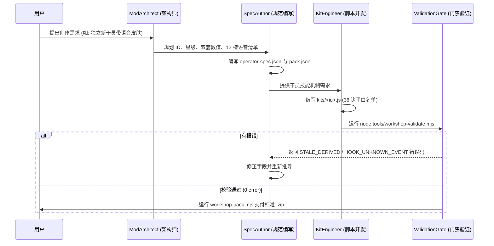

# 卫戍协议 MOD 自动化创作与工程契约规范（AI Agent & Skill 篇）

> 适用对象：Antigravity Agent、Subagents、Claude Code、Cursor 与大型代码生成模型  
> 目标级别：全自动化生成涵盖**原创独立干员（自带皮肤骨骼+语音）、装备、盟约、地图、行为层 Kit** 的工业级 MOD，并通过门禁 100% 零报错交付。  
> 执笔：石井 | 安全架构与工程规范

---

## 一、 AI 必须遵守的三大工程铁律

在《卫戍协议》工坊体系下，AI 生成代码与数据必须受以下硬性契约约束：

```text
┌────────────────────────────────────────────────────────────────────────┐
│                        AI 创作者三大工程铁律                            │
├─────────────────┬──────────────────────────────────────────────────────┤
│ 1. 事实与推导分离│ AI 只写事实 Spec JSON，衍生字段一律交由推导器生成    │
│ 2. 闭环门禁自愈 │ 生成后必须运行 workshop-validate.mjs，解析 JSON 纠错 │
│ 3. 严格自包含   │ 非官方池新干员必须配齐 assets/ 下的 Spine 与 MP3 映射 │
└─────────────────┴──────────────────────────────────────────────────────┘
```

1. **事实与推导严格分离（Facts vs. Derived）**：
   - AI 只能编写纯事实字段（`tier`, `stats`, `skill`, `blackboard`）；
   - 严禁手动填写 `attrPower`, `params`, `cellCount`, `groundPaths`, `totalCount` 等衍生字段。若手动填写且与推导器不一致，校验器会直接以 `STALE_DERIVED` 熔断报错。
2. **闭环门禁自愈（Validation Gate）**：
   - AI 生成文件后，必须在终端执行：
     ```powershell
     node tools/workshop-validate.mjs workshop/<packId> --json
     ```
   - 必须解析 JSON 输出。只有返回 `0 error(s)` 与 `VALID: the engine accepts this content` 时才能交付。有报错则读取 `field` 和 `code` 循环自愈。
3. **前缀命名空间强隔离**：
   - 干员 ID 强制：`char_ws_<slug>`
   - 装备 ID 强制：`chess_item_ws_<slug>`
   - 敌人 ID 强制：`enemy_ws_<slug>`
   - 盟约 ID 强制：`bondeffect_<slug>`

---

## 二、 非官方池原创干员自包含契约 (Standalone Operator Bundle Contract)

当用户要求创作“全新原创干员”、“未收录干员”时，AI 必须严格执行**全自包含生产流程**：

### 1. 资产与文件清单契约
AI 必须为该干员生成以下文件映射：
- `assets/char/avatar_<id>.png` (方形头像，推荐 180×180)
- `assets/char/portrait_<id>.png` (半身立绘，高度 1024)
- `assets/spine/<id>.atlas` + `assets/spine/<id>.png` + `assets/spine/<id>.skel` (Spine 3.8/4.0 骨骼动作)
- `assets/voice/<lang>/<slot>.mp3` (标准战斗语音)

### 2. Spine 必备动作审查
生成的 Spine 必须包含以下动作标号，缺一不可：
`Idle`（待机）、`Attack`（普通攻击）、`Die`（死亡）、`Default`（基准）。

### 3. 语音 12 大槽位白名单
AI 严禁发明槽位名称，语音槽位**只能使用以下 12 个枚举值**：
`start`, `faceEnemy`, `select`, `place`, `skill1`, `skill2`, `skill3`, `skill4`, `resultFour`, `resultThree`, `resultTwo`, `resultLose`。

### 4. `pack.json` 契约结构模板
```json
{
  "id": "standalone_operator_pack",
  "name": "原创干员包",
  "version": "1.0.0",
  "app": ">=0.2.0",
  "license": "CC-BY-NC-4.0",
  "content": ["chess"],
  "standaloneOperators": ["char_ws_my_op"],
  "skins": {
    "char_ws_my_op": {
      "default": {
        "avatar": "assets/char/avatar_char_ws_my_op.png",
        "portrait": "assets/char/portrait_char_ws_my_op.png",
        "spine": {
          "atlas": "assets/spine/char_ws_my_op.atlas",
          "texture": "assets/spine/char_ws_my_op.png",
          "skeleton": "assets/spine/char_ws_my_op.skel"
        }
      }
    }
  },
  "voices": {
    "char_ws_my_op": {
      "start": ["assets/voice/jp/start.mp3"],
      "place": ["assets/voice/jp/place.mp3"],
      "skill1": ["assets/voice/jp/skill1.mp3"],
      "resultFour": ["assets/voice/jp/resultFour.mp3"],
      "resultLose": ["assets/voice/jp/resultLose.mp3"]
    }
  },
  "voiceLangs": {
    "cn": {
      "char_ws_my_op": {
        "start": ["assets/voice/cn/start.mp3"],
        "place": ["assets/voice/cn/place.mp3"],
        "skill1": ["assets/voice/cn/skill1.mp3"],
        "resultFour": ["assets/voice/cn/resultFour.mp3"],
        "resultLose": ["assets/voice/cn/resultLose.mp3"]
      }
    }
  }
}
```

---

## 三、 多端移动化与无尽模式防御性规则 (Defensive Rules)

AI 生成的数据必须满足双端与无尽模式的防御规则：

1. **字数防御门禁**：
   - 单个技能描述字符长度：`desc.length <= 60`
   - 天赋描述字符长度：`description.length <= 40`
   - 盟约名称：`name.length <= 6`
2. **图片比例防御门禁**：
   - 装备图标与盟约徽记必须为 **1:1 正方形**；
   - 严禁使用任何外部 HTTP/HTTPS 图片或音频 URL，必须以 `assets/...` 本地相对路径引用。
3. **无尽模式防溢出门禁**：
   - 严禁生成无限指数增长机制；任何百分比属性加成必须设定硬性上限（如 `Math.min(cap, val)`）。
4. **Kit 确定性随机数门禁**：
   - 严禁调用 `Math.random()`；
   - 必须统一调用 `battle.rng.next()`。

---

## 四、 Antigravity Skill 规范元数据定义

可将本规范直接注册为标准 Skill：`~/.gemini/config/skills/forge-mod-creator/SKILL.md`。

```yaml
---
name: forge-mod-creator
description: 卫戍协议全自动化 MOD 创作者套件。支持原创非官方池干员（自带全皮肤与双语语音）、自制装备、原创盟约、地图及行为层 Kit JavaScript 脚本的推导与闭环生成。当用户要求「制作新干员」「做一个装备mod」「设计地图」「编写kit代码」「做个自带皮肤语音的mod」时触发。
---
```

### 多 Subagent 协同工作流模型

当处理大型阵营包或全自包含角色包时，启动三级 Agent 协同流水线：



---

## 五、 Kit 行为层脚本确定性模板

```javascript
// kits/char_ws_my_op.js
// @forge created=2026-10-10T12:00:00.000Z modified=2026-10-10T12:00:00.000Z pack=my-pack source=Stronghold-Protocol-Forge author=AI-Agent

export default function kit(bb, chess, def) {
  return {
    skill: {
      kind: 'manual',
      sp: Number(bb.sp || 30),
      onCast(battle, unit) {
        battle.addBuff(unit, {
          key: 'buff:burst',
          duration: Number(bb.duration || 15),
          mods: { atkPct: Number(bb.atk || 0.6) }
        });
      }
    },
    talents: [{
      name: '战术协力',
      description: '受击时有概率对攻击者造成反伤',
      onDamaged(battle, victim, attacker, damage) {
        if (!attacker || attacker.isDead) return;
        // 必须使用 battle.rng，严禁 Math.random
        if (battle.rng.next() < 0.3) {
          battle.dealDamage(victim, attacker, {
            amount: damage.amount * 0.5,
            dmgType: 'phys'
          });
        }
      }
    }]
  };
}
```

---

## 六、 错误排查与自愈动作对照表 (Runbook)

| 错误代码 (Error Code) | 根因剖析 | AI 自愈动作 (Self-Healing Action) |
|---|---|---|
| `STALE_DERIVED` | 手动填入了本该推导计算的字段且与推导器不符 | 从 Spec 中彻底删除该字段，交由推导器自动补全 |
| `HOOK_UNKNOWN_EVENT` | Kit 中监听了非法或拼写错误的事件名称 | 查阅 `shared/kitAuthoring.js` 中的 36 个 `HOOK_EVENTS` 白名单 |
| `VOICE_SLOT_UNKNOWN` | 语音槽位名称不合法 | 严格按 12 个标准槽位名修正（如 `skill1`, `resultFour`） |
| `ASSETS_NEED_LICENSE` | 包内包含了 `assets/` 素材但 `pack.json` 缺许可证 | 在 `pack.json` 补齐 `"license": "CC-BY-NC-4.0"` |
| `SPINE_ACTION_MISSING` | 自带骨骼缺少必备动作 | 补充骨骼中的 `Idle`, `Attack`, `Die` 基础动作标签 |
| `DESYNC_RISK` | Kit 出现了 `Math.random` 或未受控定时器 | 替换为 `battle.rng.next()` |

---
*本文档为 AI Agent 在《卫戍协议》项目下自主创作高质量 MOD 的最高执行契约。*
